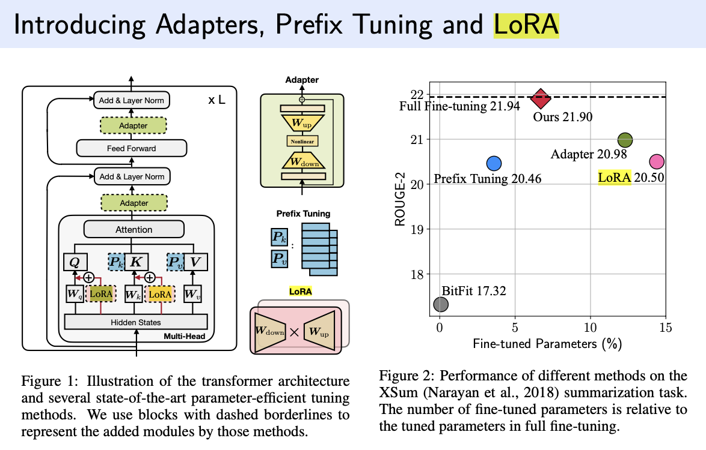

## Transformer
#### 1. BERT基本结构

Transformer的Encoder，PE + Self-attention + layernorm + (residual + FFN)

#### 2. Self-Attention公式

Attention = Softmax[(Q*K^T)/(dk)^(1/2)] *V


#### 3. BERT预训练任务

MLM: Masked language model 学习上下文信息

NSP: Next sentence pretiction 学习句子间关系

#### 4. BERT之前广泛用哪些方式解决文本分类
#### 5. BERT开头为什么要加一个[CLS]？有什么替代方法？

[CLS]提供了一种下游任务特征提取的渠道。
在预训练时，捕捉整个句子中泛化特征。但是在fine tuning时，根据具体下游任务，捕捉相应的任务特征。

替代方法：
(1) 平均或者池化整个序列token向量来表示整个序列的信息
(2) 选择序列中已有的某个token作为代表性特征

#### 6. BERT有哪些地方用到了Mask？各有什么作用？

预训练MLM任务的时候用到了Mask,用Mask掩盖15%的单词，使模型根据上下文信息来预测被掩盖的单词。
 
#### 7. BERT中Self-Attention计算复杂度是什么？怎么处理长文本？

序列长度n和模型维度d 计算复杂度为O(n^2*d)

分段处理：将长文本切分为较短的片段，然后分别对每个片段应用BERT模型。这种方法简单直接，但可能会丢失跨片段的上下文信息。

使用稀疏注意力机制：一些研究提出了稀疏版的Transformer，其中注意力机制不再关注序列中的每一个位置，而是只关注一部分位置。这样可以显著降低计算复杂度，使模型能够处理更长的序列。

#### 8. 训练Transformer-based模型中重要的超参数？调整超参数的原则？

Maxlen? Multi-head? Hidden state dim? Regularization

#### 9. 为什么Transformer比RNN好？为什么能有更高并行度？

Transformer模型在多个方面优于传统的循环神经网络（RNN），包括长期依赖问题的处理、并行计算能力以及训练大规模数据集的效率。这些优势使得Transformer成为了自然语言处理（NLP）等领域的主流模型之一。下面详细解释Transformer相比于RNN的优势：

##### 1. 长期依赖问题

- **RNN:** RNN处理序列数据时，信息需要逐步传递通过网络的每个时间步。这种结构在理论上可以捕捉长距离依赖，但在实际应用中，由于梯度消失和梯度爆炸问题，RNN难以学习到长距离序列中的依赖关系。
  
- **Transformer:** Transformer通过自注意力机制（Self-Attention Mechanism）直接计算序列中任意两个位置之间的依赖关系，无需像RNN那样逐步传递信息。这使得模型能够更有效地捕捉长期依赖，同时避免了梯度消失和爆炸问题。

##### 2. 并行计算

- **RNN:** 在RNN中，当前时间步的计算依赖于前一个时间步的输出，这种序列依赖性导致训练过程难以并行化。因此，RNN在处理长序列时会遇到显著的计算瓶颈。
  
- **Transformer:** Transformer的自注意力机制允许模型在处理序列数据时，对序列中的所有元素进行同时计算。这意味着在模型训练和推理时，可以对整个序列进行并行处理，显著提高了计算效率。

##### 3. 缩放能力

- **RNN:** RNN的扩展性受到其序列化计算特性的限制，处理大规模数据集或长序列时效率较低。
  
- **Transformer:** Transformer模型设计更易于在现代并行计算设备（如GPU和TPU）上扩展。其自注意力和前馈网络的并行计算特性使得Transformer能够有效地训练更大规模的数据集和模型。

##### 4. 特性提取能力

- **Transformer:** 通过自注意力机制，Transformer能够在计算时自动权衡和选择序列中的重要信息，而不需要显式地通过时间步进行信息传递。这种机制使得Transformer在捕捉序列内复杂模式方面表现更优，尤其是在处理具有复杂结构和语义的自然语言数据时。

总结来说，Transformer模型之所以优于RNN，主要得益于其能够有效解决长期依赖问题、具有更高的并行计算能力和更好的扩展性，以及其强大的特性提取能力。这些优势使得Transformer在自然语言处理和其他序列处理任务中取得了显著的成功。

#### 10. 读bert的那篇原论文了吗？说说bert在那篇论文中的两个主要任务。
#### 11. Encoder和Decoder层为什么都需要FFNN，目的是什么？

增加非线形特征，让序列每一个位置独立地学习和应用不同的转换，增强模型对序列每个元素的理解和表示能力。

#### 12. GPT，BERT，BARD的区别
#### 13. 为什么一开始模型微调都用bert
#### 14. BERT做分类任务的几种方式?微调到Down-Stream任务的几种方式(Lora,p-tuning,prefix-tuning,promopting)
#### 15. BERT和T5的区别

BERT专注于通过双向上下文信息来生成密集Embeddings，预训练任务有MLM和NSP两种

而T5专注于实现一个Text2Text的模型，预训练只有预测上下文缺失的文本片段一个任务，所有NLP任务都转换成Text2Text的形式。例如分类任务：

一个分类任务可以转换为输入一段文本和问题（例如，"这篇文章的情感是正面的还是负面的？"），模型的任务是生成"正面"或"负面"这样的文本作为回答。同样，翻译任务可以转换为将源语言句子作为输入，预测目标语言句子作为输出。

#### 16. 给hidden_size, head数，问Transformer参数量怎么计算
#### 17. BERT和BART区别

BART的结构包括BERT的双向编码器结构及类似GPT的自回归解码器结构。在训练过程中，BART对输入的文本进行破坏（包括文本缺失，文本置换，文本翻转等），训练模型去重新生成正确的文本内容

#### 18. BERT中，一个batch的输入需要padding，在attention时如何处理padding位置？

BERT和其他Transformer模型采用了称为“注意力掩码”（attention mask）的技术来处理填充位置。

注意力掩码（Attention Mask）

注意力掩码是一个与输入序列同样长度的向量，用于指示哪些位置是实际数据，哪些位置是填充的。在计算自注意力时，这个掩码确保模型不会考虑到填充位置的信息。

对于实际数据位置，掩码值为0。
对于填充位置，掩码值为一个非常大的负数（在实现中通常是-10000或者-inf），这样在应用softmax函数计算注意力权重时，这些位置的权重接近于0。

在计算自注意力时，每个位置的注意力权重是通过对所有位置的注意力分数应用softmax函数得到的。注意力分数通常是通过查询（query）向量和键（key）向量的点积来计算的。然后，掩码被加到这些分数上，这样填充位置的分数就会变得非常小（在softmax之后，权重接近于0）。


## NLP通用模型相关
#### 1. 模型评估指标有哪些
#### 2. 模型指标计算细节
#### 3. 生成模型采样过程中Temperature超参数的作用和常用取值

Temperature是用来调整模型输出的概率分布情况，如果Temperature=1，则输出原本的概率分布

如果Temperature>1,概率分布会变得更平坦，增加低概率事件被选中的机会，使得模型的输出多样性增加，但是可能导致输出质量降低

如果Temperature<1,概率分布变得更尖锐，减少低概率事件被选中机会，增加生成文本的确定性，倾向于重复模型在训练数据中看到更常见的模式

#### 4. 说几种对比学习的损失函数，以及它们的特点和优缺点

#### 5. 机器翻译模型评估指标对比

机器翻译模型的评估指标主要用于衡量翻译输出的质量，包括准确性、流畅性和是否忠于原文等方面。常用的评估指标有BLEU、ROUGE、METEOR、TER和BERTScore等。下面是这些指标的比较，包括它们的优缺点：

##### BLEU (Bilingual Evaluation Understudy)

- **优点**：
  - **广泛使用**：BLEU是最常用的机器翻译评估指标之一，适用于几乎所有机器翻译系统。
  - **自动化**：计算过程完全自动，易于实施和快速得到评估结果。
  - **一致性**：高BLEU分数通常与人类评估的高质量翻译相关联。
- **缺点**：
  - **忽略语义**：BLEU主要关注n-gram的匹配，可能忽略翻译的语义正确性。
  - **对长句不敏感**：对于长句的翻译，BLEU可能无法准确捕捉翻译质量。
  
##### ROUGE (Recall-Oriented Understudy for Gisting Evaluation)

- **优点**：
  - **适用于总结**：ROUGE特别适用于评估自动文本摘要和机器翻译的覆盖度和召回率。
  - **灵活性**：提供多种评估形式（如ROUGE-N、ROUGE-L），可以根据需要选择。
- **缺点**：
  - **偏向召回率**：更侧重于内容的覆盖度，可能忽略了生成文本的准确性和流畅性。

##### METEOR (Metric for Evaluation of Translation with Explicit ORdering)

- **优点**：
  - **综合评估**：同时考虑同义词、词干、词序等因素，提供更全面的评估。
  - **与人类评估更一致**：通常认为METEOR与人类评估的一致性比BLEU更高。
- **缺点**：
  - **计算复杂**：比BLEU和ROUGE更复杂，计算成本更高。

##### TER (Translation Edit Rate)

- **优点**：
  - **直观**：通过计算达到参考翻译所需的编辑次数，结果易于理解。
  - **捕捉流畅性**：能够较好地反映出文本的流畅性和自然性。
- **缺点**：
  - **可能过于严格**：对于语言的自然变异和同义替换可能过于严格。

##### BERTScore

- **优点**：
  - **考虑语义**：使用BERT嵌入来评估翻译的语义相似度，能够更好地捕捉翻译的质量。
  - **与人类评估高度相关**：通常认为其与人类评价的一致性很高。
- **缺点**：
  - **计算成本**：需要预训练的BERT模型，计算成本相对较高。

##### Perplexity
  
总结来说，每种评估指标都有其独特的优点和适用场景，但也存在一定的局限性。在实际应用中，通常会结合多个指标来全面评估机器翻译模型的性能。


## 预处理
#### 1. Word2Vec是什么？有什么弊端？与BERT相比有什么优势？
#### 2. 经典的词向量模型有哪些？

One-hot encoding, word2vec, GloVe, TF-IDF, FastText, BERT Embedding.

BERT和BPE
BERT模型采用的是WordPiece模型，这是BPE的一个变体。WordPiece与BPE类似，也是一种子词分割算法，用于将未知或罕见的词汇分解为更小的、模型已知的单元。这样，BERT能够通过组合这些已知的子单元来理解和处理未见过的词汇，从而提高了模型的通用性和灵活性。

#### 3. Skip-Gram怎么取负样本？

Skip-Gram中有一个window，对于一个词来说，在window里面的词组为正样本，不再window里面的词组为负样本。且因为window size一般不会很大，所以负样本数远大于正样本数。因此会采样一定的负样本数。

**Mikolov等人在word2vec的原始论文中提出，选择词频的3/4次方作为采样概率来选取负样本。这意味着高频词被选为负样本的概率会高于低频词，但这种差异不会像直接使用词频那样极端。**

负样本的数量：负样本的数量是一个超参数，可以根据具体任务和数据集的大小进行调整。较小的数据集或者更复杂的任务可能需要更多的负样本来帮助模型学习区分正负样本。

训练过程：在训练过程中，对于每个正样本，模型会同时考虑几个负样本。通过优化目标函数，模型学习到的词向量能够使得目标词与其上下文词的向量更加接近，而与负样本词的向量更加远离。

#### 4. 改进Word2Vec?

1. 负采样（Negative Sampling）
负采样是一种改进Word2Vec训练效率的技术，特别是对于大型语料库。原始的Word2Vec模型使用softmax函数来计算词汇表中每个词的概率，这在词汇表很大时会非常耗时。负采样通过仅更新一小部分权重（而不是整个词汇表的权重）来解决这个问题。具体来说，对于每个训练样本，除了正样本（目标词），它还随机选择少量的负样本（非目标词），并只更新这些样本的权重。这大大减少了计算复杂度，加快了训练速度。

2. 层次Softmax（Hierarchical Softmax）
层次Softmax是另一种提高Word2Vec训练效率的技术。它通过使用一种基于霍夫曼树（Huffman Tree）的二叉树结构来代替传统的softmax，减少了模型计算概率分布所需的计算量。在这个树结构中，词汇表中的每个词都对应于树的一个叶子节点。计算词的概率不再需要遍历整个词汇表，而只需要沿着树从根节点到对应叶子节点的路径进行计算，显著减少了计算量。这对于有大量词汇的数据集尤其有效。

其他改进方法
除了上述两种主要的改进方法，还有一些其他的策略被提出来增强Word2Vec模型：

子词嵌入（Subword Embedding）：如FastText模型，它在Word2Vec的基础上增加了字符级别的n-gram信息，使模型能够更好地处理罕见词和词形变化。

上下文窗口调整：动态调整上下文窗口的大小可以帮助模型更好地捕捉到词之间的关系，尤其是长距离依赖。

使用位置权重：给予距离目标词更近的上下文词更高的权重，可以提高嵌入的质量。

## 大模型
#### 1. 对于大模型的了解有多少？
#### 2. GPT主要技术原理阐述。
#### 3. ChatGPT如何实现任务泛化和能力涌现的
#### 4. LoRA的作用和原理



Low-Rank Adaptation

#### 5. LoRA的矩阵怎么初始化？为什么要初始化为全0？

初始化为0使得fine tuning开始的时候，模型基本保持原始参数状态，平滑过渡到特定任务。避免破坏预训练知识，防止随机的初始化对预训练模型输出产生较大影响

#### 6. 为什么self-attention层LoRA只在Q和K上添加，而不在V上添加

##### 简单来说，就是Q和K的相似度运算才是attention机制中获取特征的关键，和V相乘的运算不相干，为了效率，只在Q和K上加入LoRA


LoRA（Low-Rank Adaptation）在自注意力（Self-Attention）层的应用特别关注于查询（Query, Q）和键（Key, K）的矩阵，而不是值（Value, V）矩阵，这个设计考虑基于自注意力机制的工作原理和LoRA的优化目标。下面是一些解释这种设计选择的原因：

##### 自注意力机制的工作原理

自注意力机制通过计算输入序列中各元素之间的关系来生成输出序列。这个过程涉及到三个关键步骤：

1. **查询（Q）与键（K）的匹配**：自注意力层首先计算查询和键之间的相似度，用于确定序列中每个元素对其他元素的影响力度。
2. **软最大化权重**：计算出的相似度分数接着通过softmax函数转换成权重。
3. **加权求和值（V）**：最后，这些权重被用来对值进行加权求和，以生成最终的输出。

##### LoRA在Q和K上的应用原因

- **精确控制注意力分布**：通过在查询（Q）和键（K）上添加LoRA，模型能够更精细地调整序列元素之间的相互作用和注意力分布。这是因为注意力权重的计算直接受到Q和K的影响，而调整V并不会改变这些权重分布，只会影响加权求和的结果。
- **优化计算效率**：在Q和K上应用LoRA可以在不显著增加计算负担的情况下，实现对模型的有效调整。考虑到V的调整不会影响注意力权重，优化Q和K提供了一种更直接和有效的方法来改善模型的性能和适应性。
- **目标任务适应性**：LoRA的目的是通过微调来改善模型在特定任务上的表现。调整Q和K能够更直接地影响模型如何处理和理解输入数据的上下文信息，这对于大多数下游任务来说是至关重要的。

总之，LoRA选择在自注意力层的查询（Q）和键（K）上进行调整，而非值（V），是为了更有效地控制和优化注意力机制的行为，从而改善模型在下游任务上的性能。这种设计充分利用了自注意力机制的原理，通过精确调整影响注意力权重计算的因素来实现目标。

#### 7. 怎么解决预训练大模型的输入长度问题

输入分块，滑动窗口

## 其他NLP模型
#### 1. BiLSTM和CRF的原理和区别。

BiLSTM由两个LSTM层组成，捕获序列前向和后向的信息

CRF是统计建模方法，在整个序列上建模条件概率，预测考虑到了相邻标签的依赖性

区别：BiLSTM主要关注于通过捕获长期依赖关系来学习序列中每个元素的表示，而CRF关注于模型整个序列的标签分布，特别是标签之间的依赖关系

结合使用： 在一些高级的NLP任务中，BiLSTM和CRF经常结合使用，形成BiLSTM-CRF模型。这种结合模型首先使用BiLSTM来捕获序列中的上下文信息，然后使用CRF层来优化标签序列的预测，利用了BiLSTM在处理序列数据方面的优势和CRF在序列标注中考虑标签依赖性的能力

#### 2. 对于CLIP的了解

通过融合CV和NLP模型，学习text和image的特征向量，将这些向量映射到同一特征空间下，计算出最相似的两个向量进行匹配。

CLIP（Contrastive Language–Image Pre-training）是一个由OpenAI开发的先进的多模态学习模型，它旨在通过同时理解图像和与之相关的文本描述来改善计算机视觉任务的性能。CLIP模型是在2021年公开介绍的，代表了自然语言处理（NLP）和计算机视觉（CV）领域融合的一种趋势，能够在广泛的视觉任务上，无需任务特定训练数据，直接应用预训练模型进行推断。

##### 主要特点和优势

- **多模态理解**：CLIP通过训练一个视觉模型和一个文本模型来理解图像内容和文本描述之间的关系，使得模型能够捕捉到图像和文本之间的丰富语义信息。

- **零样本学习**：CLIP的一个关键特性是其零样本（zero-shot）能力，即模型能够在未经过特定任务训练的情况下，对新任务进行推断。这是通过比较图像和文本描述的嵌入向量来实现的，使得模型能够理解和处理之前未见过的类别或任务。

- **大规模预训练**：CLIP通过在大量的图像-文本对上进行预训练来学习通用的视觉-语言表示，从而能够泛化到各种视觉任务上。

##### 训练方法

CLIP使用对比学习（contrastive learning）方法进行训练。具体来说，它试图将图像和匹配的文本描述靠近，同时将图像和不匹配的文本描述分开。这样，模型学会了理解不同模态之间的语义对应关系。

##### 应用场景

CLIP在多个视觉任务上展现了出色的性能，包括但不限于：

- **图像分类**：在零样本或少样本设置下对图像进行分类。
- **对象检测**：识别图像中的对象，并了解它们的类别。
- **图像搜索**：根据文本描述来搜索匹配的图像。
- **图像-文本匹配**：确定图像和文本描述是否匹配。

CLIP的开发标志着多模态学习领域的一个重要进展，展示了通过大规模多模态预训练，如何显著提高模型在多种视觉任务上的泛化能力和灵活性。


#### 3. 常见的命名实体识别和信息抽取任务是怎么做的
#### 4. bn和ln的概念及优缺点


##### Batch Normalization (BN)

Batch Normalization 的确是在一个batch的数据中进行标准化，但它是在单个特征映射（对于全连接层）或单个激活图（对于卷积层）上进行的。对于每个特征维度，BN计算整个batch中该特征的均值和方差，并使用这些统计数据来规范化每个特征维度。因此，BN确保了一个batch内每个特征的输出分布均有相同的均值和方差。它在每个mini-batch的数据通过网络层前进行标准化处理，确保每个mini-batch的数据有着相同的均值和方差。

优点:

可以使用更高的学习率，加快模型收敛速度。
减少对初始化权重敏感度。
可以作为正则化项，减轻模型过拟合。
在很多任务中已被证明有效，尤其是在卷积神经网络中。

缺点:

**对mini-batch的大小敏感，过小的batch可能会影响效果**。

在推理（Inference）时需要额外的步骤来计算整个数据集的均值和方差：

训练时：使用当前mini-batch的统计量（均值和方差）进行标准化。
推理时：使用训练过程中累积的全局统计量（均值和方差的移动平均）进行标准化。

在序列数据中，比如时间序列或文本数据，如果序列长度不一，Batch Normalization可能不适用。

##### Layer Normalization (LN)

Layer Normalization 与BN不同，它是在单个数据点内对所有特征进行标准化。对于每个数据点，LN计算所有特征的均值和方差，并使用这些统计数据来规范化每个数据点的所有特征。在RNNs和Transformers等模型中，这意味着**每个时间步或每个位置的输出会被独立地标准化**。

优点:

不依赖于mini-batch的大小，适合batch size为1的情况或变长输入。
可以应用于RNNs和Transformers等模型。
在训练和推理时计算方式相同，没有BN中的推理时计算问题。

缺点:

在某些情况下，可能不如BN有效，尤其是在卷积网络中。
由于不依赖于batch，不能利用batch的统计信息进行正则化。

##### 关键点

- BN在batch维度上进行规范化，而LN在特征维度上进行规范化。
- BN和LN都试图将数据规范化为均值为0，方差为1的分布，但这两种标准化方法是在不同的维度上应用的。
- BN在训练时使用batch的统计数据，而在推理时使用整个数据集的统计数据；LN的计算方式在训练和推理时是相同的，因为它依赖于单个数据点的统计信息。

这些差异导致了它们在不同类型的网络和不同的任务中各有优势。

## 业务
#### 1. 搜索推荐算法主要解决的业务问题是什么？
#### 2. 设计一个语义匹配模型：从数据集构建到模型搭建、训练等。
#### 3. 哈夫曼树

哈夫曼树（Huffman Tree），也称为哈夫曼编码树，是一种特殊的二叉树，它主要用于数据的有效压缩和编码。哈夫曼树并不直接用于存储数据，而是用于构建一种最优的编码方式，使得常用的数据（字符、数字等）使用更少的位（bits）进行表示，从而达到压缩数据的目的。通过哈夫曼树，可以为数据集中的每个元素分配一个唯一的二进制编码，这些编码具有前缀码的特性，即没有任何编码是另一个编码的前缀，这样就可以无歧义地解码。

##### 构建哈夫曼树的过程如下：

1. **频率统计**：首先统计每个元素（如字符）在数据集中出现的频率或权重。
2. **初始化森林**：为数据集中的每个唯一元素创建一个节点，并将这些节点作为一个森林的初始集合，每个节点都是一棵只包含自己的树。
3. **构建树**：然后按照以下步骤迭代构建哈夫曼树：
   - 从森林中选取两个权重最小的树作为左右子树合并，创建一个新的节点，该节点的权重是两个子树权重的总和。
   - 将这个新节点加入到森林中，同时移除那两个被合并的树。
   - 重复这个过程，直到森林中只剩下一棵树，这棵树就是哈夫曼树。

##### 哈夫曼树的特点：

- **路径最短**：频率（或权重）较高的元素被放在离根节点较近的位置，这样可以确保常用元素的编码长度较短，不常用元素的编码长度较长，从而达到压缩的效果。
- **前缀唯一**：哈夫曼编码是一种前缀编码，任何字符的编码都不会是另一个字符编码的前缀，这确保了编码的唯一性和可解码性。

哈夫曼树在文件压缩（如ZIP文件格式）、数据传输等领域有着广泛的应用，是一种在信息编码和数据压缩中非常有效的数据结构。

## Python
#### 1. 浅拷贝和深拷贝


浅拷贝创建了对象的一个新副本，但**不会创建对象中引用的其他对象的副本**。
修改拷贝的数据中的**可变对象(List,Dict)**可能会影响到原数据，但修改**拷贝的数据（顶层结构）本身不会影响原数据**。


```
new = old #在一维列表中都算浅拷贝，new和old指向相同的对象

new = old[:]

new = old.copy()
```

##### 原数据会改变，因为拷贝数据中的List为可变对象

```
import copy

old = [[1,2,3],[4,5,6]]
new = copy.copy(old) or new = old[:]
new[0][0] = 99 
print(old,new)
```

##### 原数据不改变

```
import copy

old = [1,2,3,4,5,6]
new = copy.copy(old) or new = old[:]
new[0][0] = 99 
print(old,new)
```

深拷贝创建了对象及其包含的所有子对象的副本,**修改拷贝的数据,原数据不会变动**：

new = copy.deepcopy()


#### 2. Python中的线程、进程和协程

在Python中，线程、进程和协程是实现多任务编程的三种主要机制，它们各自有不同的使用场景和优缺点。下面对这三者进行比较介绍：

##### 进程（Process）

进程是操作系统进行资源分配和调度的基本单位，每个进程都有自己独立的内存空间和系统资源。在Python中，可以使用`multiprocessing`模块来创建和管理进程。

- **优点**：
  - 独立性强，进程间不共享内存，安全性高。
  - 可以利用多核CPU的优势，实现真正的并行计算。

- **缺点**：
  - 创建和销毁进程的开销较大。
  - 进程间通信（IPC）复杂，需要使用管道、消息队列等机制。

##### 线程（Thread）

线程是进程的执行单元，同一个进程内的线程共享该进程的内存空间和资源。Python的`threading`模块提供了基本的线程操作接口。

- **优点**：
  - 创建和销毁线程的开销小于进程，资源消耗更低。
  - 线程间可以直接共享进程的内存空间，数据共享和通信更方便。

- **缺点**：
  - 线程间共享内存和资源可能导致数据安全问题。
  - 在CPython中，由于全局解释器锁（GIL）的存在，多线程并不能实现CPU的并行计算。

##### 协程（Coroutine）

协程是一种用户态的轻量级线程，它通过协作而非抢占式的方式进行切换。在Python中，`asyncio`模块和`async/await`语法提供了协程的支持。

- **优点**：
  - 协程拥有极低的切换开销，不需要操作系统介入。
  - 可以有效地利用单核CPU处理高并发请求，非常适合IO密集型任务。

- **缺点**：
  - 编程模型复杂，需要理解事件循环（Event Loop）和异步编程模式。
  - 适用范围有限，主要针对IO密集型任务，对于CPU密集型任务提升有限。

##### 总结

- **进程**：适用于CPU密集型任务，以及需要进程隔离的场景。
- **线程**：适合于IO密集型任务，以及需要共享内存空间的场景。
- **协程**：最适合处理高并发的IO密集型任务，编程模式相对特殊。

选择合适的并发编程模型，需要根据具体的任务特性和性能要求来决定。在实际应用中，这三种机制也可以结合使用，以达到最优的工作效果。

#### 3. 介绍一下python中的生成器和迭代器

在Python中，迭代器（Iterators）和生成器（Generators）是实现迭代操作的两个重要概念，它们都允许你遍历数据集合，但以不同的方式实现。

##### 迭代器（Iterators）

迭代器是一个遵循迭代器协议的对象，这意味着它支持`next()`方法，每次返回集合中的下一个元素，并且在没有更多元素时抛出`StopIteration`异常。任何支持`__iter__()`方法（返回一个迭代器对象）或`__next__()`方法（返回下一个元素）的对象都可以称为迭代器。

- **创建方式**：迭代器可以通过调用一个集合对象的`__iter__()`方法或使用Python的内建函数`iter()`获得。
- **用途**：迭代器允许对集合进行迭代操作，而不需要了解集合的内部结构。
- **优点**：迭代器模式提供了一种统一的方法来遍历各种类型的数据集合，无需修改使用迭代器的代码。

##### 生成器（Generators）

生成器是一种特殊类型的迭代器，它使用简洁的语法生成序列，而不需要定义迭代器的`__iter__()`和`__next__()`方法。生成器可以通过两种方式创建：

1. **生成器函数**：使用`def`关键字定义的，但是使用`yield`语句返回数据。每次`yield`暂停函数的执行并保存上下文，下次从上次暂停的地方继续执行。
2. **生成器表达式**：类似于列表推导，但使用圆括号而不是方括号。这种方式更适合于生成较为简单的数据集合。

- **优点**：
  - **内存效率**：生成器逐个产生元素，只在迭代到某元素时才生成该元素，因此对内存的使用非常高效。
  - **延迟计算**：生成器延迟计算元素，直到真正需要它们的时候才计算，这对处理大数据集或无限序列特别有用。

##### 对比

- **共同点**：两者都可以用于迭代操作，都支持`next()`方法，按需一个接一个地返回元素。
- **不同点**：
  - **创建方式**：迭代器通常通过实现迭代器协议的类来创建，而生成器通过生成器函数或表达式创建。
  - **使用简便性**：生成器提供了一种更简洁的创建迭代器的方法，特别是当迭代逻辑较为复杂时。
  - **功能**：虽然所有生成器都是迭代器，但不是所有迭代器都是生成器。生成器通过`yield`提供了一种暂停函数执行和保存上下文的能力。

总的来说，生成器是Python中处理迭代操作的强大工具，它们提供了一种内存高效且代码简洁的方式来遍历数据集合，特别适合于数据量大或者数据集合在迭代过程中动态计算的情况。而迭代器提供了一种更通用的迭代机制，可以应用于任何可迭代的数据类型。

#### 4. list添加元素的方法

```
list.append()
list.extend(list2)
list.insert(idx,num)
new_list = list1 + list2
```

#### 5. 字典和列表的区别

Python中的列表（List）和字典（Dictionary）是两种不同的数据结构，它们各自有不同的用途和特性：

##### 列表 (List)

1. **有序集合**：列表是一个有序的元素集合，可以包含重复的值。元素的顺序是固定的，因此可以通过索引来访问列表中的元素。
2. **索引访问**：列表中的每个元素都有一个编号（索引），第一个元素的索引是0，第二个元素的索引是1，依此类推。
3. **灵活的数据类型**：列表可以包含任意类型的对象：数字、字符串、其他列表等。
4. **可变类型**：列表是可变的，这意味着可以在列表创建之后添加、删除或修改其元素。

##### 字典 (Dictionary)

1. **键值对**：字典存储的是键值对，每个键值对将一个键映射到一个值。键必须是唯一的，但值则可以不唯一。
2. **无序集合**：字典是无序的集合，不能通过索引来访问字典中的元素，而是通过键来访问。
3. **键的数据类型**：字典的键可以是任何不可变类型，如字符串、数字或元组。
4. **可变类型**：字典也是可变的，允许添加、删除或修改键值对。

##### 主要区别

- **数据组织**：列表按顺序组织元素，通过索引访问；字典存储键值对，通过键来访问值。
- **性能**：对于按键访问元素，字典一般比列表更快，因为字典是通过哈希表实现的，这使得查找效率非常高。
- **用途**：列表通常用于存储一系列有序项目，字典用于存储关联数据。

根据需要存储和访问数据的方式，可以选择使用列表或字典。例如，如果需要通过名称查找或更新数据，字典可能是更好的选择；如果需要保持数据的插入顺序，列表可能更适合。

#### 6. 修饰器的概念

修饰器本质上是一个函数，**它接受一个函数作为参数并返回一个新的函数**。修饰器可以在不修改原函数内部代码的情况下，给函数添加额外的功能。这种功能可以是日志记录、性能测试、事务处理、缓存、权限校验等。

```
@my_decorator
def say_hello(name):
    print(f"Hello, {name}!")
```

在原始函数只输入Hello的基础上进行修饰，运行修饰器中额外的内容。

