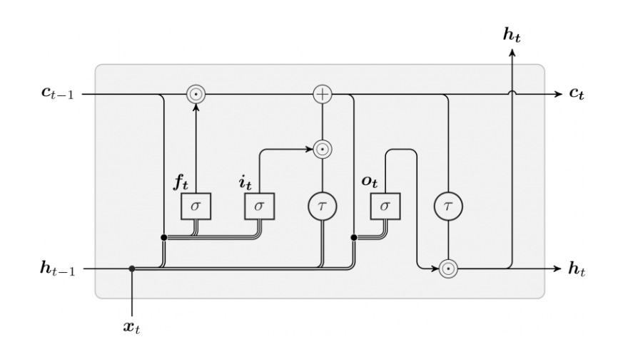
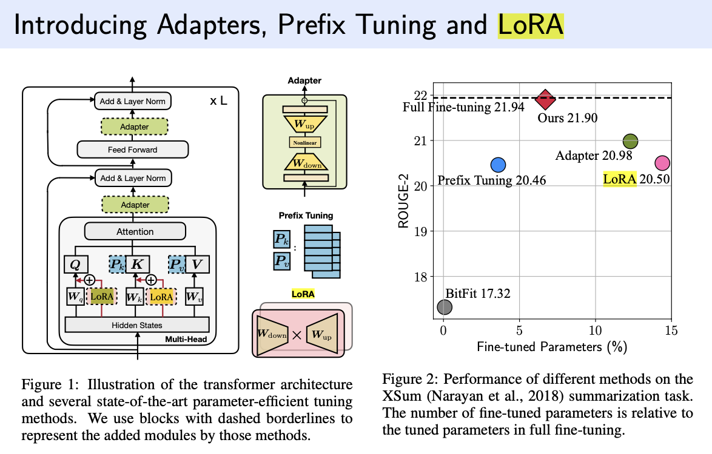
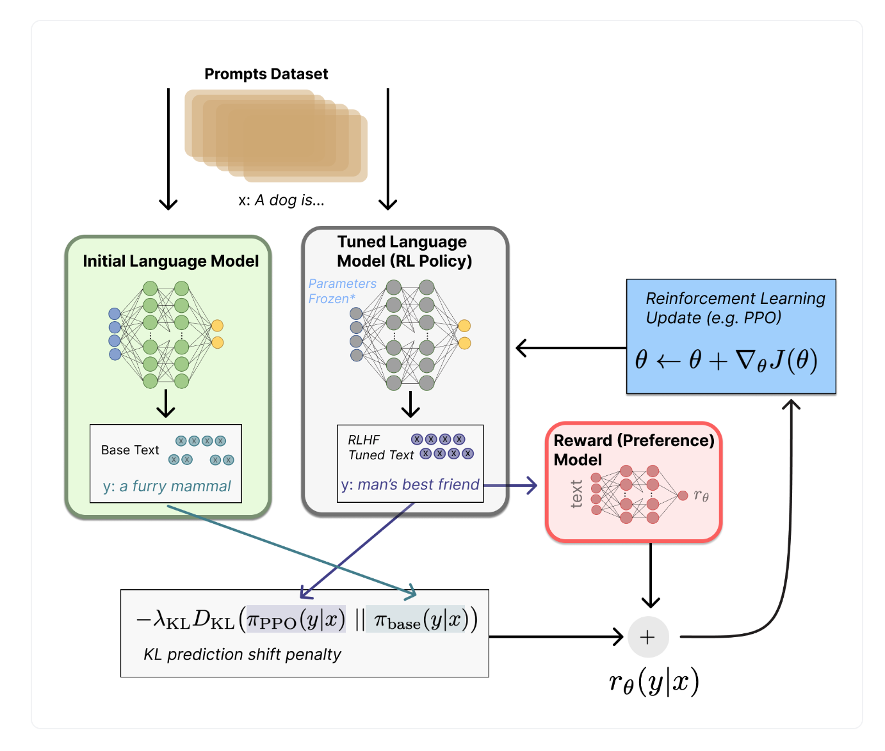

## Transformer
#### 1. BERT基本结构

Transformer的Encoder，PE + Self-attention + layernorm + (residual + FFN)

#### 2. Self-Attention公式

Attention = Softmax[(Q*K^T)/(dk)^(1/2)] *V


#### 3. BERT预训练任务

MLM: Masked language model 学习上下文信息

NSP: Next sentence pretiction 学习句子间关系

#### 4. BERT之前广泛用哪些方式解决文本分类
#### 5. BERT开头为什么要加一个[CLS]？有什么替代方法？

[CLS]提供了一种下游任务特征提取的渠道。
在预训练时，捕捉整个句子中泛化特征。但是在fine tuning时，根据具体下游任务，捕捉相应的任务特征。

替代方法：
(1) 平均或者池化整个序列token向量来表示整个序列的信息
(2) 选择序列中已有的某个token作为代表性特征

#### 6. BERT有哪些地方用到了Mask？各有什么作用？

预训练MLM任务的时候用到了Mask,用Mask掩盖15%的单词，使模型根据上下文信息来预测被掩盖的单词。
 
#### 7. BERT中Self-Attention计算复杂度是什么？怎么处理长文本？

序列长度n和模型维度d 计算复杂度为O(n^2*d)

分段处理：将长文本切分为较短的片段，然后分别对每个片段应用BERT模型。这种方法简单直接，但可能会丢失跨片段的上下文信息。

使用稀疏注意力机制：一些研究提出了稀疏版的Transformer，其中注意力机制不再关注序列中的每一个位置，而是只关注一部分位置。这样可以显著降低计算复杂度，使模型能够处理更长的序列。

#### 8. 训练Transformer-based模型中重要的超参数？调整超参数的原则？

Maxlen? Multi-head? Hidden state dim? Regularization

#### 9. 为什么Transformer比RNN好？为什么能有更高并行度？

Transformer模型在多个方面优于传统的循环神经网络（RNN），包括长期依赖问题的处理、并行计算能力以及训练大规模数据集的效率。这些优势使得Transformer成为了自然语言处理（NLP）等领域的主流模型之一。下面详细解释Transformer相比于RNN的优势：

##### 1. 长期依赖问题

- **RNN:** RNN处理序列数据时，信息需要逐步传递通过网络的每个时间步。这种结构在理论上可以捕捉长距离依赖，但在实际应用中，由于梯度消失和梯度爆炸问题，RNN难以学习到长距离序列中的依赖关系。
  
- **Transformer:** Transformer通过自注意力机制（Self-Attention Mechanism）直接计算序列中任意两个位置之间的依赖关系，无需像RNN那样逐步传递信息。这使得模型能够更有效地捕捉长期依赖，同时避免了梯度消失和爆炸问题。

##### 2. 并行计算

- **RNN:** 在RNN中，当前时间步的计算依赖于前一个时间步的输出，这种序列依赖性导致训练过程难以并行化。因此，RNN在处理长序列时会遇到显著的计算瓶颈。
  
- **Transformer:** Transformer的自注意力机制允许模型在处理序列数据时，对序列中的所有元素进行同时计算。这意味着在模型训练和推理时，可以对整个序列进行并行处理，显著提高了计算效率。

##### 3. 缩放能力

- **RNN:** RNN的扩展性受到其序列化计算特性的限制，处理大规模数据集或长序列时效率较低。
  
- **Transformer:** Transformer模型设计更易于在现代并行计算设备（如GPU和TPU）上扩展。其自注意力和前馈网络的并行计算特性使得Transformer能够有效地训练更大规模的数据集和模型。

##### 4. 特性提取能力

- **Transformer:** 通过自注意力机制，Transformer能够在计算时自动权衡和选择序列中的重要信息，而不需要显式地通过时间步进行信息传递。这种机制使得Transformer在捕捉序列内复杂模式方面表现更优，尤其是在处理具有复杂结构和语义的自然语言数据时。

总结来说，Transformer模型之所以优于RNN，主要得益于其能够有效解决长期依赖问题、具有更高的并行计算能力和更好的扩展性，以及其强大的特性提取能力。这些优势使得Transformer在自然语言处理和其他序列处理任务中取得了显著的成功。

#### 10. 读bert的那篇原论文了吗？说说bert在那篇论文中的两个主要任务。
#### 11. Encoder和Decoder层为什么都需要FFNN，目的是什么？

增加非线形特征，让序列每一个位置独立地学习和应用不同的转换，增强模型对序列每个元素的理解和表示能力。

#### 12. GPT，BERT，BARD（Gemini）的区别

Gemini基于**特定的对话数据**集训练，而ChatGPT在互联网文本中训练

Gemini使用了新的混合注意力机制，包括了全局注意力机制和**局部注意力机制**

使用了**GELU激活函数**，在处理负数时，不会像RELU那样直接裁剪到0，缓解梯度消失问题

#### 13. 为什么一开始模型微调都用bert
#### 14. BERT做分类任务的几种方式?微调到Down-Stream任务的几种方式(Lora,p-tuning,prefix-tuning,promopting)
#### 15. BERT和T5的区别

BERT专注于通过双向上下文信息来生成密集Embeddings，预训练任务有MLM和NSP两种

而T5专注于实现一个Text2Text的模型，预训练只有预测上下文缺失的文本片段一个任务，所有NLP任务都转换成Text2Text的形式。例如分类任务：

一个分类任务可以转换为输入一段文本和问题（例如，"这篇文章的情感是正面的还是负面的？"），模型的任务是生成"正面"或"负面"这样的文本作为回答。同样，翻译任务可以转换为将源语言句子作为输入，预测目标语言句子作为输出。

#### 16. 给hidden_size, head数，问Transformer参数量怎么计算
#### 17. BERT和BART区别

BART的结构包括BERT的双向编码器结构及类似GPT的自回归解码器结构。在训练过程中，BART对输入的文本进行破坏（包括文本缺失，文本置换，文本翻转等），训练模型去重新生成正确的文本内容

#### 18. BERT中，一个batch的输入需要padding，在attention时如何处理padding位置？

BERT和其他Transformer模型采用了称为“注意力掩码”（attention mask）的技术来处理填充位置。

注意力掩码（Attention Mask）

注意力掩码是一个与输入序列同样长度的向量，用于指示哪些位置是实际数据，哪些位置是填充的。在计算自注意力时，这个掩码确保模型不会考虑到填充位置的信息。

对于实际数据位置，掩码值为0。
对于填充位置，掩码值为一个非常大的负数（在实现中通常是-10000或者-inf），这样在应用softmax函数计算注意力权重时，这些位置的权重接近于0。

在计算自注意力时，每个位置的注意力权重是通过对所有位置的注意力分数应用softmax函数得到的。注意力分数通常是通过查询（query）向量和键（key）向量的点积来计算的。然后，掩码被加到这些分数上，这样填充位置的分数就会变得非常小（在softmax之后，权重接近于0）。


#### 19. Transformer和BERT的位置编码

**Transformer**：
选用正余弦函数：在[-1,1]之间，通过调整移动频率因子，将所有的position赋予独特的高维表达。储存的是**绝对位置**

周期性函数而不是单调函数：周期函数能处理长序列（单调函数对长序列的position不能很好适应）

**BERT**：
位置编码：BERT 采用了一种非参数化的位置编码方法。在预训练阶段，BERT 为序列中的每个位置准备了一个唯一的位置向量，这些位置向量是**可学习的参数**，并在模型训练过程中一同学习。这意味着每个位置的编码在训练开始时是**随机初始化的，随后通过训练得到优化**。

#### 20. 多头低纬度Attention VS 单头高维度Attention

1. Feature Diversity 2. Computational Efficiency

#### 21. 为什么在进行softmax之前需要对attention进行scaled（为什么除以dk的平方根)

假设 Q 和 K 的均值为0，方差为1。它们的矩阵乘积将有均值为0，方差为dk，因此使用dk的平方根被用于缩放，因为，Q和K的矩阵乘积的均值本应该为0，方差本应该为1，这样可以获得更**平缓的softmax**。当**维度很大时，点积结果会很大，会导致softmax的梯度很小**。为了减轻这个影响，对点积进行缩放。

#### 22. 为什么Attention用点乘计算而不是加法

点乘的几何意义->直接描述两个向量的相似性，并且计算更加高效

#### 23. 为什么Q和K不直接跟自己点乘？

Q如果自己跟自己(Q)相乘的话，那么根据向量点乘知识知道，俩个向量越相似，内积越大，当一个向量与自己做内积，再与其他不同词的向量做内积后(行成一个打分向量)，该向量经过softmax后，就会变为一个有一个位置的值特殊的大(自己与自己相乘)，其他位置的值非常非常小的状况出现，比如[0.98,0.01,0.05,0.05]那么,这样的得分再与V矩阵相乘后得出的加权向量就是一个基本上跟自己本身差不多的矩阵，那就失去了self attention的意义啦


## NLP通用模型相关
#### 1. 模型评估指标有哪些

1. 精确率（Precision）
定义：正类预测中正确的比例。
计算：(真正类) / (真正类 + 假正类)。
使用场景：当假正类的成本较高时，例如在垃圾邮件检测中，将正常邮件错误分类为垃圾邮件的代价很大。
2. 召回率（Recall）或敏感性
定义：实际为正的样本中，模型正确识别的比例。
计算：(真正类) / (真正类 + 假负类)。
使用场景：当遗漏正类的成本较高时，例如在疾病筛查中，遗漏一个病例的代价很大。
3. F1分数
定义：精确率和召回率的调和平均，是精确率与召回率的平衡指标。
计算：2 * (精确率 * 召回率) / (精确率 + 召回率)。
使用场景：当需要考虑精确率和召回率的平衡时，特别是当类别分布不平衡时。
4. ROC曲线和AUC
定义：
ROC（接收者操作特征曲线）反映了真正类率和假正类率之间的关系。
AUC（曲线下面积）量化ROC曲线下的整体性能。
使用场景：二分类问题，尤其是在预测性能在不同阈值下的变化时。

ROC曲线的特点和解读
曲线越接近左上角，模型的性能越好：理想情况下，最佳的分类模型的ROC曲线会经过左上角（即TPR=1，FPR=0），表示模型能够完美区分正负类别。
曲线下面积（AUC）：ROC曲线下的面积被称为AUC（Area Under the Curve）。AUC值越接近1，表示模型性能越好；AUC值为0.5则相当于随机猜测。
阈值的选择：ROC曲线提供了在不同阈值下TPR和FPR之间的权衡，帮助决策者根据具体应用选择最佳阈值。例如，如果假正类的成本很高（比如在医疗诊断中将健康人误诊为病人），可能会选择一个使FPR尽可能低的阈值，即使这会牺牲一些TPR。

#### 2. 模型指标计算细节
#### 3. 生成模型采样过程中Temperature超参数的作用和常用取值

Temperature是用来调整模型输出的概率分布情况，如果Temperature=1，则输出原本的概率分布

如果Temperature>1,概率分布会变得更平坦，增加低概率事件被选中的机会，使得模型的输出多样性增加，但是可能导致输出质量降低

如果Temperature<1,概率分布变得更尖锐，减少低概率事件被选中机会，增加生成文本的确定性，倾向于重复模型在训练数据中看到更常见的模式

#### 4. 说几种对比学习的损失函数，以及它们的特点和优缺点

#### 5. 机器翻译模型评估指标对比

机器翻译模型的评估指标主要用于衡量翻译输出的质量，包括准确性、流畅性和是否忠于原文等方面。常用的评估指标有BLEU、ROUGE、METEOR、TER和BERTScore等。下面是这些指标的比较，包括它们的优缺点：

##### BLEU (Bilingual Evaluation Understudy)

- **优点**：
  - **广泛使用**：BLEU是最常用的机器翻译评估指标之一，适用于几乎所有机器翻译系统。
  - **自动化**：计算过程完全自动，易于实施和快速得到评估结果。
  - **一致性**：高BLEU分数通常与人类评估的高质量翻译相关联。
- **缺点**：
  - **忽略语义**：BLEU主要关注n-gram的匹配，可能忽略翻译的语义正确性。
  - **对长句不敏感**：对于长句的翻译，BLEU可能无法准确捕捉翻译质量。
  
##### ROUGE (Recall-Oriented Understudy for Gisting Evaluation)

- **优点**：
  - **适用于总结**：ROUGE特别适用于评估自动文本摘要和机器翻译的覆盖度和召回率。
  - **灵活性**：提供多种评估形式（如ROUGE-N、ROUGE-L），可以根据需要选择。
- **缺点**：
  - **偏向召回率**：更侧重于内容的覆盖度，可能忽略了生成文本的准确性和流畅性。

##### METEOR (Metric for Evaluation of Translation with Explicit ORdering)

- **优点**：
  - **综合评估**：同时考虑同义词、词干、词序等因素，提供更全面的评估。
  - **与人类评估更一致**：通常认为METEOR与人类评估的一致性比BLEU更高。
- **缺点**：
  - **计算复杂**：比BLEU和ROUGE更复杂，计算成本更高。

##### TER (Translation Edit Rate)

- **优点**：
  - **直观**：通过计算达到参考翻译所需的编辑次数，结果易于理解。
  - **捕捉流畅性**：能够较好地反映出文本的流畅性和自然性。
- **缺点**：
  - **可能过于严格**：对于语言的自然变异和同义替换可能过于严格。

##### BERTScore

- **优点**：
  - **考虑语义**：使用BERT嵌入来评估翻译的语义相似度，能够更好地捕捉翻译的质量。
  - **与人类评估高度相关**：通常认为其与人类评价的一致性很高。
- **缺点**：
  - **计算成本**：需要预训练的BERT模型，计算成本相对较高。

##### Perplexity
  
总结来说，每种评估指标都有其独特的优点和适用场景，但也存在一定的局限性。在实际应用中，通常会结合多个指标来全面评估机器翻译模型的性能。

#### 6. LSTM三个门的公式推导

#### 7. bn和ln的概念及优缺点


##### Batch Normalization (BN)

Batch Normalization 的确是在一个batch的数据中进行标准化，但它是在单个特征映射（对于全连接层）或单个激活图（对于卷积层）上进行的。对于每个特征维度，BN计算整个batch中该特征的均值和方差，并使用这些统计数据来规范化每个特征维度。因此，BN确保了一个batch内每个特征的输出分布均有相同的均值和方差。它在每个mini-batch的数据通过网络层前进行标准化处理，确保每个mini-batch的数据有着相同的均值和方差。

优点:

可以使用更高的学习率，加快模型收敛速度。
减少对初始化权重敏感度。
可以作为正则化项，减轻模型过拟合。
在很多任务中已被证明有效，尤其是在卷积神经网络中。

缺点:

**对mini-batch的大小敏感，过小的batch可能会影响效果**。

在推理（Inference）时需要额外的步骤来计算整个数据集的均值和方差：

训练时：使用当前mini-batch的统计量（均值和方差）进行标准化。
推理时：使用训练过程中累积的全局统计量（均值和方差的移动平均）进行标准化。

在序列数据中，比如时间序列或文本数据，如果序列长度不一，Batch Normalization可能不适用。

##### Layer Normalization (LN)

Layer Normalization 与BN不同，它是在单个数据点内对所有特征进行标准化。对于每个数据点，LN计算所有特征的均值和方差，并使用这些统计数据来规范化每个数据点的所有特征。在RNNs和Transformers等模型中，这意味着**每个时间步或每个位置的输出会被独立地标准化**。

优点:

不依赖于mini-batch的大小，适合batch size为1的情况或变长输入。
可以应用于RNNs和Transformers等模型。
在训练和推理时计算方式相同，没有BN中的推理时计算问题。

缺点:

在某些情况下，可能不如BN有效，尤其是在卷积网络中。
由于不依赖于batch，不能利用batch的统计信息进行正则化。

##### 关键点

- BN在batch维度上进行规范化，而LN在特征维度上进行规范化。
- BN和LN都试图将数据规范化为均值为0，方差为1的分布，但这两种标准化方法是在不同的维度上应用的。
- BN在训练时使用batch的统计数据，而在推理时使用整个数据集的统计数据；LN的计算方式在训练和推理时是相同的，因为它依赖于单个数据点的统计信息。

这些差异导致了它们在不同类型的网络和不同的任务中各有优势。

多头注意力层和激活函数层之间。CV使用BN是认为**channel维度的信息对cv方面**有重要意义，如果对channel维度也归一化会造成不同通道信息一定的损失。而同理nlp领域认为**句子长度不一致，并且各个batch的信息没什么关系**，因此只考虑**句子内信息**的归一化，也就是LN

#### 8. Pre-LN和Post-LN

Pre-LN（Pre-Layer Normalization）：将LayerNorm层移到残差连接之前。这种方式被发现可以提高模型训练的稳定性，并且使得模型更容易训练。例如，在GPT-3和T5模型中，采用了Pre-LN结构。

Post-LN（Post-Layer Normalization）：这是Transformer原始设计中的LayerNorm位置，即在残差连接之后。

造成Post-LN梯度分布出现问题的核心原因在于各子层之后的 Layer Normalization层会使得各层的输入尺度与层数L无关，因此当Layer Normalization对梯度进行归一化时，也与层数L无关。相比于Post-LN结构梯度分布的不稳定，Pre-LN在各层之间梯度范数几乎保持不变，这种结构明显更利于优化器进行优化。而在进行一定轮数的 warm-up后，Post-LN的梯度范数也基本保持不变，并且其量级非常小(上图中绿色)，这也验证了Post-LN在warm-up阶段的训练不稳定性问题。

当使用Pre-LN结构时，warm-up阶段已不再是必需，并且Pre-LN结构可以大幅提升Transformer的收敛速度。对于机器翻译任务（IWSLT/WMT)，不需要warm-up的Pre-LN结构可以比Post-LN收敛快1倍左右，而在BERT上，Pre-LN在下游任务上达到和Post-LN相同的性能也只需要后者迭代轮数的1/3左右，并且最终的效果也更好。





#### 9. 模型初始化方法，尤其是He初始化

He初始化，也称为He正态初始化，是一种权重初始化方法，由Kaiming He等人在2015年提出，专门针对深度神经网络中ReLU（Rectified Linear Unit）激活函数的使用场景设计。He初始化方法旨在解决深层网络中的权重初始化问题，特别是在使用ReLU及其变体作为激活函数时，帮助保持信号的方差，从而避免训练过程中的梯度消失或爆炸问题。

##### 使用场景

He初始化通常在以下场景中使用：

- **当网络使用ReLU及其变体作为激活函数时**：由于ReLU激活函数的非线性特性，它在正区间内是线性的，但在负区间内输出为零。这种特性使得网络在正区间的信号可以保持不变，但也容易导致梯度消失问题，特别是在深度网络中。He初始化通过调整权重的初始方差来匹配ReLU的特性，减少这种风险。

- **深度神经网络**：深度网络由于层数多，非常容易在前向传播和反向传播过程中遇到梯度消失或梯度爆炸的问题。He初始化通过保持每一层的输出方差接近于输入方差，帮助缓解这些问题，使得深度网络的训练变得更加稳定。

##### 方法概述

He初始化的核心思想是在初始化时考虑到ReLU激活函数的特性，将网络中的权重初始化为从以0为中心的高斯分布随机抽取，其标准差为\(\sqrt{\frac{2}{n_l}}\)，其中\(n_l\)是该层输入的单位数（也就是权重矩阵的大小）。这种方法基于保持激活函数前后方差一致的原则，以确保网络深层的信号不会因为过多的层次而消失或爆炸。

##### 对比其他初始化方法

- **Xavier/Glorot初始化**：适用于激活函数是Sigmoid或Tanh的场景，其初始化标准差为\(\sqrt{\frac{1}{n_l}}\)，其中\(n_l\)是输入单元数。这种方法旨在保持信号在整个网络中的方差一致，但对于ReLU激活函数来说，He初始化更为合适。

- **简单的随机初始化**（如小随机数初始化）：可能导致信号强度在网络中迅速衰减或增强，从而引发梯度消失或爆炸问题，尤其是在深度网络中。

总之，He初始化提供了一种有效的方法来初始化使用ReLU及其变体作为激活函数的深度神经网络，有助于加速收敛，提高训练稳定性。


#### 10. 为什么训练神经网络要随机初始化模型参数

训练神经网络时随机初始化模型参数是至关重要的，主要出于以下几个原因：

### 1. **破坏对称性**
神经网络的每一层都包含多个神经元，这些神经元在学习过程中需要能够学到不同的特征或表示。如果所有参数初始化为相同的值（比如全零），**每个神经元将会在每次迭代中接收到完全相同的梯度更新**。这意味着所有神经元将会学到相同的特征，无论网络有多深。随机初始化参数打破了这种对称性，使得每个神经元能够开始学习不同的特征。

### 2. **提高收敛速度**
适当的随机初始化可以帮助算法更快地收敛。如果参数初始化得太小，激活函数（如sigmoid或tanh）可能会处在其饱和区，这将导致梯度消失，进而使得学习过程缓慢。相反，如果参数初始化得太大，那么激活函数可能会处于其非饱和区，这可能导致梯度爆炸问题。**恰当的随机初始化可以避免这些极端情况，促进更稳定和快速的收敛**。

### 3. **提升模型的泛化能力**
随机初始化可以引入一定量的噪声，这有助于模型的泛化能力。如果**参数初始化过于接近零或相同，模型可能会陷入局部最优，而随机初始化提供的初始参数多样性可以增加找到全局最优的概率**。此外，这种初始化策略可以避免模型在训练开始时就过于自信，从而提高其对未见数据的泛化性能。

总之，随机初始化模型参数是确保神经网络能够有效学习和泛化的关键步骤，它通过打破对称性、提高收敛速度、增强泛化能力，并适应深度学习的动态性质来实现这一点。在模型训练的过程中，合适的初始化方法能够显著影响训练效果和最终模型的性能。


## 预处理
#### 1. Word2Vec是什么？有什么弊端？与BERT相比有什么优势？
#### 2. 经典的词向量模型有哪些？

One-hot encoding, word2vec, GloVe, TF-IDF, FastText, BERT Embedding.

BERT和BPE
BERT模型采用的是WordPiece模型，这是BPE的一个变体。WordPiece与BPE类似，也是一种子词分割算法，用于将未知或罕见的词汇分解为更小的、模型已知的单元。这样，BERT能够通过组合这些已知的子单元来理解和处理未见过的词汇，从而提高了模型的通用性和灵活性。

FastText与BPE的区别
目标不同：FastText旨在通过学习词的子部分来捕捉词的内部结构，从而生成词向量和进行文本分类。而BPE主要用于文本的预处理，通过分解词为子词来减少模型的词汇量和增强模型对未见词的处理能力。

方法不同：FastText通过固定长度的n-gram来分解词，而BPE则是基于统计频率动态地合并字符或字符序列。

应用场景不同：FastText可以直接用于生成词向量和文本分类任务。BPE则更多地被用于预训练语言模型的输入表示，帮助模型更有效地处理大量文本数据。

#### 3. Skip-Gram怎么取负样本？

Skip-Gram中有一个window，对于一个词来说，在window里面的词组为正样本，不再window里面的词组为负样本。且因为window size一般不会很大，所以负样本数远大于正样本数。因此会采样一定的负样本数。

**Mikolov等人在word2vec的原始论文中提出，选择词频的3/4次方作为采样概率来选取负样本。这意味着高频词被选为负样本的概率会高于低频词，但这种差异不会像直接使用词频那样极端。**

负样本的数量：负样本的数量是一个超参数，可以根据具体任务和数据集的大小进行调整。较小的数据集或者更复杂的任务可能需要更多的负样本来帮助模型学习区分正负样本。

训练过程：在训练过程中，对于每个正样本，模型会同时考虑几个负样本。通过优化目标函数，模型学习到的词向量能够使得目标词与其上下文词的向量更加接近，而与负样本词的向量更加远离。

#### 4. 改进Word2Vec?

1. 负采样（Negative Sampling）
负采样是一种改进Word2Vec训练效率的技术，特别是对于大型语料库。原始的Word2Vec模型使用softmax函数来计算词汇表中每个词的概率，这在词汇表很大时会非常耗时。负采样通过仅更新一小部分权重（而不是整个词汇表的权重）来解决这个问题。具体来说，对于每个训练样本，除了正样本（目标词），它还随机选择少量的负样本（非目标词），并只更新这些样本的权重。这大大减少了计算复杂度，加快了训练速度。

2. 层次Softmax（Hierarchical Softmax）
层次Softmax是另一种提高Word2Vec训练效率的技术。它通过使用一种基于霍夫曼树（Huffman Tree）的二叉树结构来代替传统的softmax，减少了模型计算概率分布所需的计算量。在这个树结构中，词汇表中的每个词都对应于树的一个叶子节点。计算词的概率不再需要遍历整个词汇表，而只需要沿着树从根节点到对应叶子节点的路径进行计算，显著减少了计算量。这对于有大量词汇的数据集尤其有效。

其他改进方法
除了上述两种主要的改进方法，还有一些其他的策略被提出来增强Word2Vec模型：

子词嵌入（Subword Embedding）：如FastText模型，它在Word2Vec的基础上增加了字符级别的n-gram信息，使模型能够更好地处理罕见词和词形变化。

上下文窗口调整：动态调整上下文窗口的大小可以帮助模型更好地捕捉到词之间的关系，尤其是长距离依赖。

使用位置权重：给予距离目标词更近的上下文词更高的权重，可以提高嵌入的质量。

#### 5. KMP算法
#### 6. 中文分词

##### Jieba分词

Jieba分词是一个流行的中文分词Python库，它支持三种分词模式：**精确模式、全模式和搜索引擎模式**。Jieba分词的核心原理结合了基于规则（树结构中储存的词）和基于统计（HMM估计OOV词）的方法，以达到高效且准确的分词效果。下面是Jieba分词的主要原理和特点：

1. 基于Trie树结构的词典
Jieba分词利用Trie树结构存储一个大规模的词典，并且每个中文字符作为Trie树的一个节点。在分词过程中，通过匹配输入文本中的字符序列与Trie树中的路径，快速识别出词汇。

2. 基于统计的模型
Jieba分词使用了基于统计的模型，如HMM（隐马尔可夫模型），来处理中文分词的歧义消解问题。这主要用于识别新词以及处理一些没有出现在词典中的词汇。

HMM模型：通过训练得到的模型，可以识别出词语的边界，特别是对于人名、地名等专有名词的识别上，HMM模型表现较好。

训练HMM模型：使用大量已分词的文本作为训练数据，通过统计各种字符在不同标注（B、I、E、S）下的出现频率，以及标注转移的频率，来估计HMM的参数，即状态转移概率和发射概率。

分词时使用HMM模型：

当遇到词典中不存在的字序列时，Jieba会使用HMM模型来处理这部分文本。
基于HMM模型和Viterbi算法，计算给定观测序列（即连续的字符序列）下，最可能的状态序列（即每个字符是属于B、I、E、S中的哪一个）。
根据得到的状态序列，将观测序列分割成词。

3. 分词模式
精确模式：默认模式，试图将句子最精确地切开，适合文本分析；
全模式：将句子中所有可以成词的词语都扫描出来，速度非常快，但是不能解决歧义；
搜索引擎模式：在精确模式的基础上，对长词再次切分，提供更多的可能词语，适合用于搜索引擎分词。

##### 中文BERT模型

使用的分词算法是基于字（Character）级别

1. 字级别处理
中文BERT模型将每个中文字符作为一个独立的单元进行处理。由于中文是一种以字为基本单位的语言，这种方法相比传统的词汇分割方法简单有效。每个中文字符直接对应到一个唯一的ID，这样的处理方法简化了分词过程，并减少了词汇表的大小。

2. 特殊字符处理
尽管中文BERT主要处理单个字符，但它也能识别和处理一些特殊字符或标点符号。这些特殊字符被视为独立的单元，与普通的中文字符以相同的方式处理。

3. 使用字向量
在中文BERT中，每个中文字符都被映射为一个高维空间中的向量。这些字向量是模型训练过程中学习得到的，能够捕捉不同字符之间的语义和语法关系。

4. 兼容WordPiece
尽管中文BERT主要是基于字符的处理，但它也兼容WordPiece算法。WordPiece算法主要用于处理英文和其他需要分词的语言，它通过将未知或罕见单词分割成更小的片段（subwords）来解决词汇外（OOV）问题。对于中文，虽然直接使用字作为基本单位，但在处理一些包含英文或数字的文本时，WordPiece算法仍然可以发挥作用。

#### BPE和WordPiece区别

1. 优化目标：BPE关注于通过统计频率来减少文本中的不同字符对数量，而WordPiece的合并策略是为了最大化语言模型的性能。
2. 分词策略：虽然两者都是迭代合并字符序列，但WordPiece在选择合并哪些字符时考虑的是对模型性能的影响，而BPE主要依据字符对的出现频率。
3. 应用背景：BPE和WordPiece都被用于构建大型语言模型的词汇表，但WordPiece特别为Google的BERT模型使用，而BPE则在多种场景下应用，包括OpenAI的GPT系列模型。

## 大模型
#### 1. 对于大模型的了解有多少？
#### 2. GPT主要技术原理阐述。
#### 3. ChatGPT如何实现任务泛化和能力涌现的
#### 4. LoRA的作用和原理



Low-Rank Adaptation

#### 5. LoRA的矩阵怎么初始化？为什么要初始化为全0？

初始化为0使得fine tuning开始的时候，模型基本保持原始参数状态，平滑过渡到特定任务。避免破坏预训练知识，防止随机的初始化对预训练模型输出产生较大影响

#### 6. 为什么self-attention层LoRA只在Q和K上添加，而不在V上添加

##### 简单来说，就是Q和K的相似度运算才是attention机制中获取特征的关键，和V相乘的运算不相干，为了效率，只在Q和K上加入LoRA


LoRA（Low-Rank Adaptation）在自注意力（Self-Attention）层的应用特别关注于查询（Query, Q）和键（Key, K）的矩阵，而不是值（Value, V）矩阵，这个设计考虑基于自注意力机制的工作原理和LoRA的优化目标。下面是一些解释这种设计选择的原因：

##### 自注意力机制的工作原理

自注意力机制通过计算输入序列中各元素之间的关系来生成输出序列。这个过程涉及到三个关键步骤：

1. **查询（Q）与键（K）的匹配**：自注意力层首先计算查询和键之间的相似度，用于确定序列中每个元素对其他元素的影响力度。
2. **软最大化权重**：计算出的相似度分数接着通过softmax函数转换成权重。
3. **加权求和值（V）**：最后，这些权重被用来对值进行加权求和，以生成最终的输出。

##### LoRA在Q和K上的应用原因

- **精确控制注意力分布**：通过在查询（Q）和键（K）上添加LoRA，模型能够更精细地调整序列元素之间的相互作用和注意力分布。这是因为注意力权重的计算直接受到Q和K的影响，而调整V并不会改变这些权重分布，只会影响加权求和的结果。
- **优化计算效率**：在Q和K上应用LoRA可以在不显著增加计算负担的情况下，实现对模型的有效调整。考虑到V的调整不会影响注意力权重，优化Q和K提供了一种更直接和有效的方法来改善模型的性能和适应性。
- **目标任务适应性**：LoRA的目的是通过微调来改善模型在特定任务上的表现。调整Q和K能够更直接地影响模型如何处理和理解输入数据的上下文信息，这对于大多数下游任务来说是至关重要的。

总之，LoRA选择在自注意力层的查询（Q）和键（K）上进行调整，而非值（V），是为了更有效地控制和优化注意力机制的行为，从而改善模型在下游任务上的性能。这种设计充分利用了自注意力机制的原理，通过精确调整影响注意力权重计算的因素来实现目标。

#### 7. 怎么解决预训练大模型的输入长度问题

输入分块，滑动窗口

#### 8. ChatGLM和ChatGPT的实现路径区别

#### 9. Prefix-tuning和Prompt-tuning有什么区别


作用层次:Prefix-tuning直接作用于模型的内部表示和层级，通过引入**任务特定的前缀向量**来调整模型的行为；而Prompt tuning作用于输入文本层面，通过设计**特定的文本提示**来引导模型理解和执行任务。

目标:虽然两者都旨在调整预训练模型以适应特定任务，但prefix-tuning更侧重于通过**修改模型的内部状态**来实现，而 prompt-tuning则依赖于利用模型已有的知识和推理能力，通过语言提示来激发模型的任务执行能力。

实现方式:Prefix-tuning通过训练**前缀向量**实现，不需要改变模型原有的权重;Prompt-tuning则是通过设计和插入特定的文本提示来实现，同样不直接改变模型的权重。

额外信息长度:Prefix-tuning一般是固定长度的向量，而Prompt-tuning一般是可变的自然语言

参数效率Prefix-tuning高于Prompt-tuning

#### 10. Retrieval-Augmented Generation

RAG是一种结合了信息检索和文本生成能力的模型：GPT+额外的文档搜索系统

给定一个查询时，先在外部文档数据中找到最相关的信息。将检索到的文档信息输入GPT模型，作为查询的额外上下文信息

在一些特定场景的文本生成任务中非常有用


#### 11. RLHF流程？？




1. **预训练GPT模型（模型A）**：
   这是训练开始前的原始语言模型，它已经通过大量的数据进行了预训练，学会了语言的基本模式和结构。

2. **数据集准备和初始监督微调（得到模型B）**：
   你从数据集中提取prompts，并让人类提供对应的高质量回答。然后你使用这些prompt和回答对模型A进行监督学习，得到一个在特定任务上表现更好的微调模型，称之为模型B。

3. **人类反馈和reward模型训练**：
   再次使用新的prompts，由模型B生成多个可能的回答，并让人类评估这些回答的质量。然后你使用这些数据来训练一个reward模型，该模型的目的是预测人类评价者对模型输出质量的偏好。

4. **强化学习和策略更新（更新模型B）**：
   在这个阶段，你让微调过的模型B生成回答，并使用reward模型来评价这些回答。然后，通过一个强化学习算法（如PPO）根据reward模型的反馈来进一步更新模型B的策略。这里的KL散度是用来确保在更新策略的时候，新的策略不会偏离原始模型A太远，这有助于维持语言模型的一致性和可靠性。

最终，经过强化学习调整的模型B将被用于实际应用，因为它现在生成的文本更符合人类评价者的偏好。这个过程可以迭代进行，以进一步提高模型性能。

注意，这个过程可能涉及到一些技术细节，比如如何确切地定义reward模型的结构，或者如何平衡探索（生成多样化的回答）和利用（生成高评分的回答）等。但总体上，你对RLHF的描述是正确的。

## 其他NLP模型
#### 1. BiLSTM和CRF的原理和区别。

BiLSTM由两个LSTM层组成，捕获序列前向和后向的信息

CRF是统计建模方法，在整个序列上建模条件概率，预测考虑到了相邻标签的依赖性。CRF通过训练学习转移矩阵来学习不同标签之间的依赖性，该矩阵包含了从一个标签转移到另一个标签的概率权重。确保全局最优

区别：BiLSTM主要关注于通过捕获长期依赖关系来学习序列中每个元素的表示，而CRF关注于模型整个序列的标签分布，特别是标签之间的依赖关系

结合使用： 在一些高级的NLP任务中，BiLSTM和CRF经常结合使用，形成BiLSTM-CRF模型。这种结合模型首先使用BiLSTM来捕获序列中的上下文信息，然后使用CRF层来优化标签序列的预测，利用了BiLSTM在处理序列数据方面的优势和CRF在序列标注中考虑标签依赖性的能力

#### 2. 对于CLIP的了解

通过融合CV和NLP模型，学习text和image的特征向量，将这些向量映射到同一特征空间下，计算出最相似的两个向量进行匹配。

CLIP（Contrastive Language–Image Pre-training）是一个由OpenAI开发的先进的多模态学习模型，它旨在通过同时理解图像和与之相关的文本描述来改善计算机视觉任务的性能。CLIP模型是在2021年公开介绍的，代表了自然语言处理（NLP）和计算机视觉（CV）领域融合的一种趋势，能够在广泛的视觉任务上，无需任务特定训练数据，直接应用预训练模型进行推断。

##### 主要特点和优势

- **多模态理解**：CLIP通过训练一个视觉模型和一个文本模型来理解图像内容和文本描述之间的关系，使得模型能够捕捉到图像和文本之间的丰富语义信息。

- **零样本学习**：CLIP的一个关键特性是其零样本（zero-shot）能力，即模型能够在未经过特定任务训练的情况下，对新任务进行推断。这是通过比较图像和文本描述的嵌入向量来实现的，使得模型能够理解和处理之前未见过的类别或任务。

- **大规模预训练**：CLIP通过在大量的图像-文本对上进行预训练来学习通用的视觉-语言表示，从而能够泛化到各种视觉任务上。

##### 训练方法

CLIP使用对比学习（contrastive learning）方法进行训练。具体来说，它试图将图像和匹配的文本描述靠近，同时将图像和不匹配的文本描述分开。这样，模型学会了理解不同模态之间的语义对应关系。

##### 应用场景

CLIP在多个视觉任务上展现了出色的性能，包括但不限于：

- **图像分类**：在零样本或少样本设置下对图像进行分类。
- **对象检测**：识别图像中的对象，并了解它们的类别。
- **图像搜索**：根据文本描述来搜索匹配的图像。
- **图像-文本匹配**：确定图像和文本描述是否匹配。

CLIP的开发标志着多模态学习领域的一个重要进展，展示了通过大规模多模态预训练，如何显著提高模型在多种视觉任务上的泛化能力和灵活性。


#### 3. 常见的命名实体识别和信息抽取任务是怎么做的

#### 4. LDA是什么模型

非监督模型，用来做topic modeling。在一个文档集中，把每个文档看成一组主题的混合，每个主题由一些特征词的组成。学习文档中主题的分布和主题中词的分布

#### 5. GBDT

GBDT的核心思想是每一次建立的模型都是为了减少上一次的残差，即当前模型的目标是学习预测上一个模型残差的方向。具体步骤如下：

初始化：使用一个基本模型（通常是一个常数值）作为初始预测的基础。
迭代建树：对每一轮的残差建立一个决策树。
梯度下降：使用梯度下降算法来减少残差，即找到每个决策树的最优权重。
加权求和：将所有决策树的预测结果乘以相应的权重，然后加总得到最终的预测结果。

#### 6. XGBoost

XGBoost（eXtreme Gradient Boosting）是一种高效且广泛使用的机器学习算法，属于集成学习方法中的一种，更具体地说，是**梯度提升决策树（GBDT）的一种实现**。

XGBoost的主要特点和优势包括：

性能和效率：XGBoost在算法层面进行了优化，使用了**多线程和分布式计算，因此在处理大规模数据时更快更有效**。  
**正则化**：XGBoost在损失函数中加入了正则化项，有助于减少模型的复杂度，避免过拟合。  
灵活性：XGBoost支持用户自定义优化目标和评价标准，这提高了算法的灵活性，可以针对不同问题定制化求解策略。  
**缺失值处理**：XGBoost可以自动处理缺失值，使得处理不完整数据集成为可能。  
剪枝：XGBoost采用的是深度优先的策略进行树的生长，并加入了剪枝，与传统的梯度提升方法相比，这可以有效避免过拟合。  
内置交叉验证：XGBoost可以在每一轮迭代中使用交叉验证，以找到最优的迭代次数。  
可解释性：虽然XGBoost属于集成学习模型且较为复杂，但它提供了重要性分数，帮助理解每个特征对模型预测的贡献度。

XGBoost算法的工作原理是：它初始化为一个基础模型，通常是一个**简单的常数，然后逐步添加树模型**，每次添加的树都是尝试纠正**前面所有树模型的预测残差**。通过不断迭代，逐渐提升模型的预测性能。每一步的树构建都是通过**优化一个包含梯度信息和正则化项的目标函数**来实现的，这保证了模型的泛化能力和预测准确度。  

## 业务
#### 1. 搜索推荐算法主要解决的业务问题是什么？
#### 2. 设计一个语义匹配模型：从数据集构建到模型搭建、训练等。
#### 3. 哈夫曼树

哈夫曼树（Huffman Tree），也称为哈夫曼编码树，是一种特殊的二叉树，它主要用于数据的有效压缩和编码。哈夫曼树并不直接用于存储数据，而是用于构建一种最优的编码方式，使得常用的数据（字符、数字等）使用更少的位（bits）进行表示，从而达到压缩数据的目的。通过哈夫曼树，可以为数据集中的每个元素分配一个唯一的二进制编码，这些编码具有前缀码的特性，即没有任何编码是另一个编码的前缀，这样就可以无歧义地解码。

##### 构建哈夫曼树的过程如下：

1. **频率统计**：首先统计每个元素（如字符）在数据集中出现的频率或权重。
2. **初始化森林**：为数据集中的每个唯一元素创建一个节点，并将这些节点作为一个森林的初始集合，每个节点都是一棵只包含自己的树。
3. **构建树**：然后按照以下步骤迭代构建哈夫曼树：
   - 从森林中选取两个权重最小的树作为左右子树合并，创建一个新的节点，该节点的权重是两个子树权重的总和。
   - 将这个新节点加入到森林中，同时移除那两个被合并的树。
   - 重复这个过程，直到森林中只剩下一棵树，这棵树就是哈夫曼树。

##### 哈夫曼树的特点：

- **路径最短**：频率（或权重）较高的元素被放在离根节点较近的位置，这样可以确保常用元素的编码长度较短，不常用元素的编码长度较长，从而达到压缩的效果。
- **前缀唯一**：哈夫曼编码是一种前缀编码，任何字符的编码都不会是另一个字符编码的前缀，这确保了编码的唯一性和可解码性。

哈夫曼树在文件压缩（如ZIP文件格式）、数据传输等领域有着广泛的应用，是一种在信息编码和数据压缩中非常有效的数据结构。

## Python
#### 1. 浅拷贝和深拷贝


浅拷贝创建了对象的一个新副本，但**不会创建对象中引用的其他对象的副本**。
修改拷贝的数据中的**可变对象(List,Dict)**可能会影响到原数据，但修改**拷贝的数据（顶层结构）本身不会影响原数据**。


```
new = old #在一维列表中都算浅拷贝，new和old指向相同的对象

new = old[:]

new = old.copy()
```

##### 原数据会改变，因为拷贝数据中的List为可变对象

```
import copy

old = [[1,2,3],[4,5,6]]
new = copy.copy(old) or new = old[:]
new[0][0] = 99 
print(old,new)
```

##### 原数据不改变

```
import copy

old = [1,2,3,4,5,6]
new = copy.copy(old) or new = old[:]
new[0][0] = 99 
print(old,new)
```

深拷贝创建了对象及其包含的所有子对象的副本,**修改拷贝的数据,原数据不会变动**：

new = copy.deepcopy()


#### 2. Python中的线程、进程和协程

在Python中，线程、进程和协程是实现多任务编程的三种主要机制，它们各自有不同的使用场景和优缺点。下面对这三者进行比较介绍：

##### 进程（Process）

进程是操作系统进行资源分配和调度的基本单位，每个进程都有自己独立的内存空间和系统资源。在Python中，可以使用`multiprocessing`模块来创建和管理进程。

- **优点**：
  - 独立性强，进程间不共享内存，安全性高。
  - 可以利用多核CPU的优势，实现真正的并行计算。

- **缺点**：
  - 创建和销毁进程的开销较大。
  - 进程间通信（IPC）复杂，需要使用管道、消息队列等机制。

##### 线程（Thread）

线程是进程的执行单元，同一个进程内的线程共享该进程的内存空间和资源。Python的`threading`模块提供了基本的线程操作接口。

- **优点**：
  - 创建和销毁线程的开销小于进程，资源消耗更低。
  - 线程间可以直接共享进程的内存空间，数据共享和通信更方便。

- **缺点**：
  - 线程间共享内存和资源可能导致数据安全问题。
  - 在CPython中，由于全局解释器锁（GIL）的存在，多线程并不能实现CPU的并行计算。

##### 协程（Coroutine）

协程是一种用户态的轻量级线程，它通过协作而非抢占式的方式进行切换。在Python中，`asyncio`模块和`async/await`语法提供了协程的支持。

- **优点**：
  - 协程拥有极低的切换开销，不需要操作系统介入。
  - 可以有效地利用单核CPU处理高并发请求，非常适合IO密集型任务。

- **缺点**：
  - 编程模型复杂，需要理解事件循环（Event Loop）和异步编程模式。
  - 适用范围有限，主要针对IO密集型任务，对于CPU密集型任务提升有限。

##### 总结

- **进程**：适用于CPU密集型任务，以及需要进程隔离的场景。
- **线程**：适合于IO密集型任务，以及需要共享内存空间的场景。
- **协程**：最适合处理高并发的IO密集型任务，编程模式相对特殊。

选择合适的并发编程模型，需要根据具体的任务特性和性能要求来决定。在实际应用中，这三种机制也可以结合使用，以达到最优的工作效果。

#### 3. 介绍一下python中的生成器和迭代器

在Python中，迭代器（Iterators）和生成器（Generators）是实现迭代操作的两个重要概念，它们都允许你遍历数据集合，但以不同的方式实现。

##### 迭代器（Iterators）

迭代器是一个遵循迭代器协议的对象，这意味着它支持`next()`方法，每次返回集合中的下一个元素，并且在没有更多元素时抛出`StopIteration`异常。任何支持`__iter__()`方法（返回一个迭代器对象）或`__next__()`方法（返回下一个元素）的对象都可以称为迭代器。

- **创建方式**：迭代器可以通过调用一个集合对象的`__iter__()`方法或使用Python的内建函数`iter()`获得。
- **用途**：迭代器允许对集合进行迭代操作，而不需要了解集合的内部结构。
- **优点**：迭代器模式提供了一种统一的方法来遍历各种类型的数据集合，无需修改使用迭代器的代码。

##### 生成器（Generators）

生成器是一种特殊类型的迭代器，它使用简洁的语法生成序列，而不需要定义迭代器的`__iter__()`和`__next__()`方法。生成器可以通过两种方式创建：

1. **生成器函数**：使用`def`关键字定义的，但是使用`yield`语句返回数据。每次`yield`暂停函数的执行并保存上下文，下次从上次暂停的地方继续执行。
2. **生成器表达式**：类似于列表推导，但使用圆括号而不是方括号。这种方式更适合于生成较为简单的数据集合。

- **优点**：
  - **内存效率**：生成器逐个产生元素，只在迭代到某元素时才生成该元素，因此对内存的使用非常高效。
  - **延迟计算**：生成器延迟计算元素，直到真正需要它们的时候才计算，这对处理大数据集或无限序列特别有用。

##### 对比

- **共同点**：两者都可以用于迭代操作，都支持`next()`方法，按需一个接一个地返回元素。
- **不同点**：
  - **创建方式**：迭代器通常通过实现迭代器协议的类来创建，而生成器通过生成器函数或表达式创建。
  - **使用简便性**：生成器提供了一种更简洁的创建迭代器的方法，特别是当迭代逻辑较为复杂时。
  - **功能**：虽然所有生成器都是迭代器，但不是所有迭代器都是生成器。生成器通过`yield`提供了一种暂停函数执行和保存上下文的能力。

总的来说，生成器是Python中处理迭代操作的强大工具，它们提供了一种内存高效且代码简洁的方式来遍历数据集合，特别适合于数据量大或者数据集合在迭代过程中动态计算的情况。而迭代器提供了一种更通用的迭代机制，可以应用于任何可迭代的数据类型。

#### 4. list添加元素的方法

```
list.append()
list.extend(list2)
list.insert(idx,num)
new_list = list1 + list2
```

#### 5. 字典和列表的区别

Python中的列表（List）和字典（Dictionary）是两种不同的数据结构，它们各自有不同的用途和特性：

##### 列表 (List)

1. **有序集合**：列表是一个有序的元素集合，可以包含重复的值。元素的顺序是固定的，因此可以通过索引来访问列表中的元素。
2. **索引访问**：列表中的每个元素都有一个编号（索引），第一个元素的索引是0，第二个元素的索引是1，依此类推。
3. **灵活的数据类型**：列表可以包含任意类型的对象：数字、字符串、其他列表等。
4. **可变类型**：列表是可变的，这意味着可以在列表创建之后添加、删除或修改其元素。

##### 字典 (Dictionary)

1. **键值对**：字典存储的是键值对，每个键值对将一个键映射到一个值。键必须是唯一的，但值则可以不唯一。
2. **无序集合**：字典是无序的集合，不能通过索引来访问字典中的元素，而是通过键来访问。
3. **键的数据类型**：字典的键可以是任何不可变类型，如字符串、数字或元组。
4. **可变类型**：字典也是可变的，允许添加、删除或修改键值对。

##### 主要区别

- **数据组织**：列表按顺序组织元素，通过索引访问；字典存储键值对，通过键来访问值。
- **性能**：对于按键访问元素，字典一般比列表更快，因为字典是通过哈希表实现的，这使得查找效率非常高。
- **用途**：列表通常用于存储一系列有序项目，字典用于存储关联数据。

根据需要存储和访问数据的方式，可以选择使用列表或字典。例如，如果需要通过名称查找或更新数据，字典可能是更好的选择；如果需要保持数据的插入顺序，列表可能更适合。

#### 6. 修饰器的概念

修饰器本质上是一个函数，**它接受一个函数作为参数并返回一个新的函数**。修饰器可以在不修改原函数内部代码的情况下，给函数添加额外的功能。这种功能可以是日志记录、性能测试、事务处理、缓存、权限校验等。

```
@my_decorator
def say_hello(name):
    print(f"Hello, {name}!")
```

在原始函数只输入Hello的基础上进行修饰，运行修饰器中额外的内容。

#### 7. 哈希冲突

哈希冲突（Hash Collision）是指在使用哈希函数将不同的输入（或键）映射到哈希表时，**两个或多个不同的输入被映射到了哈希表的同一个位置（或槽位）**的情况。哈希冲突会影响哈希表的性能。在理想情况下，哈希表的查找、插入和删除操作的时间复杂度是O(1)。但当发生哈希冲突时，多个元素可能需要被存储在同一个位置（例如通过链表），这就需要**额外的时间来处理这些元素**，增加了操作的时间复杂度。

解决方法：

1. 分离链接法：在每个哈希表槽位上关联一个链表

2. 开放寻址法：所有元素储存在哈希表数组中，发生冲突后，通过某种探测序列，寻找下一个空闲槽位

3. 双重散列：一种特例的开放寻址法，使用两个哈希表来计算元素的储存位置。一个储存元素，另一个计算如果当前发生冲突，应该去到下一个空闲槽位的步长

确定步长的方法:

步长step的计算公式为：
step = h_2(x)

步长需满足：非零值，与哈希表大小互质

4. 一致性哈希：哈希环

5. 线性探测：遇到冲突，顺序往下查一个空的位置


#### 8. List去重复

1. `list(set(list)`

2. 循环语句，用额外的数组

3. 用字典的Key，用list生成一个字典，因为字典Key保证不相同，且插入顺序不变。把字典的keys变回list就可以了

4. 如果是大数据的话，可以使用pandas.drop_dulicates().tolist()


#### 9. 垃圾回收机制

Python的垃圾回收（Garbage Collection, GC）机制主要是通过引用计数（Reference Counting）来实现的，同时也包括了循环引用检测和清除的机制来处理更复杂的场景。Python的垃圾回收机制确保了不再被使用的内存可以被及时回收，减少内存泄漏。以下是这些机制的详细说明：

##### 引用计数

Python内部使用引用计数来跟踪每个对象被引用的次数。当一个对象的引用计数降至0时，意味着此对象不再被任何变量或者其他对象引用，因此可以安全地被回收。这个过程几乎是即时的，是Python垃圾回收机制的基础。

- **增加引用计数**：当对象被新的引用指向时，其引用计数增加。
- **减少引用计数**：当引用离开其作用域或被明确删除时，其引用计数减少。

##### 循环引用

尽管引用计数是一个有效的垃圾回收机制，但它不能处理循环引用的情况。循环引用发生在两个或多个对象相互引用，形成一个闭环，即使它们已经不再被外部引用，它们的引用计数也不会降到0。为了解决这个问题，Python引入了循环垃圾收集器，它能够检测这种情况并回收这些对象。

##### 垃圾回收器

Python的垃圾回收器主要处理循环引用的问题。它是一个可选的组件，在大多数Python实现中默认启用。垃圾回收器**使用了一种叫做“标记-清除”（mark-sweep）的算法来检测和回收循环引用的对象。此外，还有一个“分代收集”（Generational Collection）的概念，它基于对象存活时间的假设（即最新创建的对象更有可能被回收），将对象分为几代，优先回收最新的那一代对象**。

##### 手动管理垃圾回收

虽然Python的垃圾回收是自动进行的，但是开发者可以通过`gc`模块来手动控制。例如，你可以手动触发垃圾回收过程，或者调整垃圾回收器的配置（如启用或禁用它，或者调整分代回收的阈值）。

总的来说，Python的垃圾回收机制是一个结合了引用计数和循环垃圾收集的复杂系统，它旨在自动管理内存使用，减少内存泄漏。然而，了解这个机制的工作原理对于优化程序性能和避免内存问题仍然是有帮助的。


#### 10. 函数传参

当参数为**可变对象**（如List）时，传参采用的是**引用**传递，修改形参将对实参造成影响；当参数为**不可变对象**（如果Int或String）时，传参采用的是**值**传递，**修改形参对实参无影响**


#### 11. torch.tensor怎么增加一个维度

```
x = torch.randn(5,5)

# convert to (1,5,5)

x_unsqueeze = x.unsqueeze(0)

x_none = x[None,:]

x_torch_unsqueeze = torch.unsqueeze(x,0)

x_reshape = x.reshape(1,5,5)

x_view = x.view(1,5,5)
```
#### 12. view和reshape的区别

view要求数据在内存中是**连续**的

```
import torch

x = torch.randn(4, 4)
y = x.transpose(0, 1)  # 交换维度，使得y不再在内存中连续

try:
    z = y.view(16)  # 这里可能会抛出错误，因为y不是连续的
    #z = y.contiguous().view(16) 需要把tensor改成continous
except RuntimeError as e:
    print(f"view错误: {e}")

z = y.reshape(16)  # reshape可以处理非连续的情况
print("reshape成功改变形状")

```


